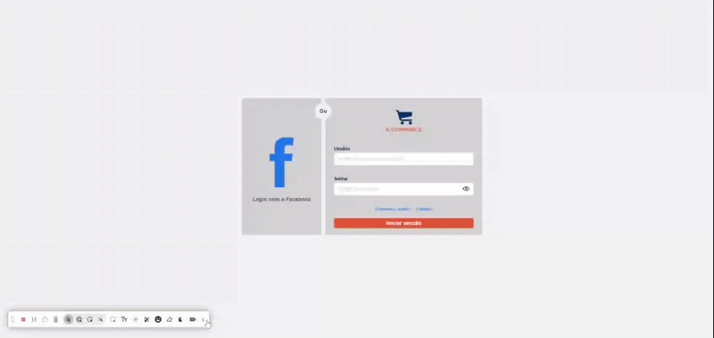

<<<<<<< HEAD
# E-commerce-Product
=======
# 🏆 E-commerce

<div style="background: #fff; text-align: center">
  
</div>

<br>

Esta é uma aplicação Angular responsiva em formato SPA (Single Page Application) que tem como objetivo apresentar um painel administrativo de e-commerce, onde o usuário pode criar, editar e excluir produtos.

<br>

## Demonstração da Aplicação

<br>

<div style="text-align: center">
  
</div>

<br><hr>


<br>


## 📄 Instruções para Login

A autenticação **mockada** , gerando um token fictício com base nos dados inseridos no formulário de login.

### 🧪 Dados para Acesso

1. **Usuário:** Pode ser qualquer nome por exemplo, seu próprio nome.
2. **Senha:** Aceita qualquer valor, desde que **não esteja vazia**.

> Observação: Como a autenticação é apenas simulada, não há validação real com uma Api. O objetivo é apenas permitir a navegação na aplicação como se o login fosse válido e gerar um token para o guarda de rotas. 

<br>

## 📄 Documentação Técnica

Pensando na experiência do usuário e na eficiência do sistema, foram implementados os seguintes recursos:

### 🚀 Experiência do Usuário

- **Paginação de Produtos:** A listagem de produtos conta com paginação automática a partir de 6 itens, garantindo uma visualização mais organizada e evitando scroll.
- **Filtro de Busca:** Componente de busca avançada, permitindo ao usuário filtrar produtos com base em critérios específicos.
- **Geração de ID para Novo Produto:** Lógica implementada para geração automática e sequencial de identificadores ao cadastrar novos produtos.
- **Modal de Confirmação de Exclusão:** Modal para confirmação de exclusão de produtos, prevenindo ações acidentais.
- **Validação de Formulários:** Validações reativas nos formulários, assegurando o preenchimento correto dos campos obrigatórios.
- **Mensagens de Feedback:** Sistema de mensagens visuais (toasts) que fornecem retorno imediato ao usuário após suas ações (sucesso, erro).

### 🧩 Estrutura e Funcionamento da Aplicação

- **Lazy Loading:** Carregamento sob demanda de componentes, melhorando a performance geral da aplicação.
- **Reactive Forms:** Utilização de formulários reativos para melhor controle e validação dinâmica dos dados.
- **Guarda de Rotas:** Proteção de rotas com autenticação, impedindo o acesso a telas restritas sem login.
- **Separação de Responsabilidades:** Arquitetura organizada com clara separação entre componentes, serviços e módulos, facilitando a manutenção e escalabilidade do sistema.


## 🛠️ Tecnologias Utilizadas

* [Angular (v19)](https://angular.io/) - Framework para construção da interface de usuário.
* [Ngx-Bootstrap](https://valor-software.com/ngx-bootstrap/) - Biblioteca de componentes do Angular.
* [Bootstrap](https://getbootstrap.com/) - Biblioteca de estilos CSS para facilitar o layout e a responsividade.
* [RxJS](https://rxjs.dev/) - Biblioteca para programação reativa com streams de dados.
* [Ngx-Toastr](https://www.npmjs.com/package/ngx-toastr) - Biblioteca para exibir notificações e feedback visual ao usuário.
* [Ngx-Pagination](https://www.npmjs.com/package/ngx-pagination) - Biblioteca para a criar a paginação usada na listagem de produtos.
* [Uuid](https://www.npmjs.com/package/uuid) - Biblioteca usada para criar ids dinâmicos.

## 📂 Estrutura de Pastas do Projeto

```bash
├── public/            // Armazenamento de Arquivos.
└── src/
    └── app/
        ├── auth/      // Login da aplicação.
        ├── core/      // Guarda de rotas e serviço de Token.
        ├── features/  // Funcionalidades desenvolvidas.
        ├── layouts/   // Monta o layout da aplicação (SPA).
        ├── shared/    // Componentes, Enums, Services e Interfaces de compartilhamento.
        └── app.config.ts
```


## ⚙️ Como Executar o Projeto Localmente

### ✅ Pré-requisitos

* [Node.js](https://nodejs.org/) (versão LTS recomendada)
* [Angular CLI](https://angular.io/cli) (Instalação global: `npm install -g @angular/cli`)
* [Git](https://git-scm.com/)

### 👣 Passos para Execução

1.  Clone o repositório:
    ```bash
    git clone https://github.com/Terchaki/E-commerce-Product.git
    ```
2.  Instale as dependências do projeto:
    ```bash
    npm install
    ```
3.  Inicie o servidor de desenvolvimento:
    ```bash
    ng serve -o
    ```
    Este comando irá construir a aplicação e abrir automaticamente no seu navegador em `http://localhost:4200`.

    <br>
## ⚙️ Testes

### 👣 Passos para Execução

1.  Abrir um novo terminal na raiz do projeto:
2.  Execute o seguinte comando:
    ```bash
    ng test
    ```
Este comando irá abrir automaticamente no seu navegador.

<br><br>

## ✨ Sugestões de Melhorias 

* **Autenticação via Api:** Implementar autenticação via Api para gerar o Token Jwt e ResfreshToken.
* **Inclusão de Interceptors:** Implementar interceptor para envio do Token Jwt nas requisições Http.
* **Autenticação integrada:** Implementar autenticação integrada a acessos de outras plataformas com o usuário do Facebook.
* **Exportação para PDF:** Adicionar a funcionalidade de gerar arquivo PDF contendo a listagem dos produtos como relatório em formato de tabela, utilizando bibliotecas front-end como `jsPDF` e `jspdf-autotable`, dispensando a necessidade de lógica no backend para esta funcionalidade.
* **Inclusão Tela de Dashboards:** Implementar tela de gráficos para análise detalhadas dos produtos.

<br>

## 🧑‍💻 Autor

* **Nome:** Lucas Henrique
* **E-mail:** lucas.dev.contato@outlook.com
* [LinkedIn](https://www.linkedin.com/in/lucas-henrique-sousa-mendes/)
>>>>>>> 7d8fb34 (organized branch)
